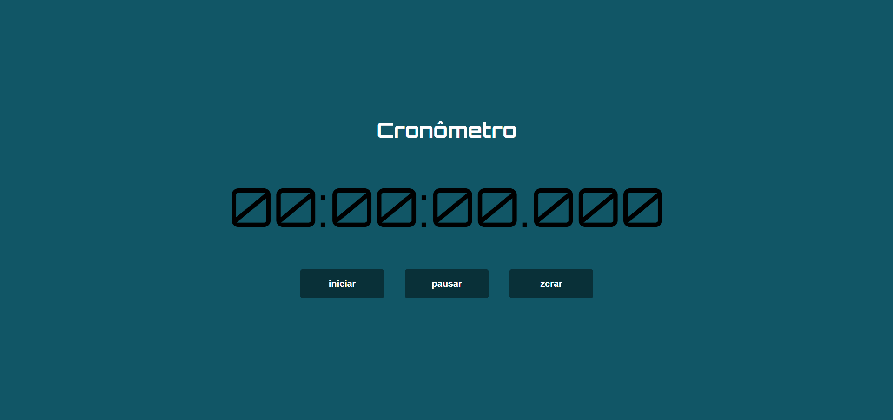

# ⏱️ Cronômetro




> Projeto criado durante o curso de [JavaScript e TypeScript](https://www.udemy.com/course/curso-de-javascript-moderno-do-basico-ao-avancado/), ministrado por: [Luiz Otávio Miranda](https://github.com/luizomf)

## 👾 Tecnologias utilizadas

<div align="left">
  
  
  
  
  
</div>

### Ajustes e melhorias

O projeto ainda está em desenvolvimento e as próximas atualizações serão voltadas para as seguintes tarefas:

- [ ] Adicionar a opção de Timer;
- [ ] Adicionar a função de Volta.

## 🚀 Rodando o projeto

Para rodar o projeto, siga estas etapas:

Git Bash:

```
git clone https://github.com/Matheusccp2/cronometro.git
```

## 📫 Contribuindo para o Projeto

Para contribuir com o Projeto, siga estas etapas:

1. Bifurque este repositório.
2. Crie um branch: `git checkout -b <nome_branch>`.
3. Faça suas alterações e confirme-as: `git commit -m '<mensagem_commit>'`
4. Envie para o branch original: `git push origin <nome_do_projeto> / <local>`
5. Crie a solicitação de pull.

Como alternativa, consulte a documentação do GitHub em [como criar uma solicitação pull](https://help.github.com/en/github/collaborating-with-issues-and-pull-requests/creating-a-pull-request).

## 🤝 Criador do Projeto

<table>
  <tr>
    <td align="center">
      <a href="https://github.com/Matheusccp2" title="defina o título do link" target="_blank">
        <br>
        <sub>
          <b>Matheus Costa</b>
        </sub>
      </a>
    </td>
  </tr>
</table>
